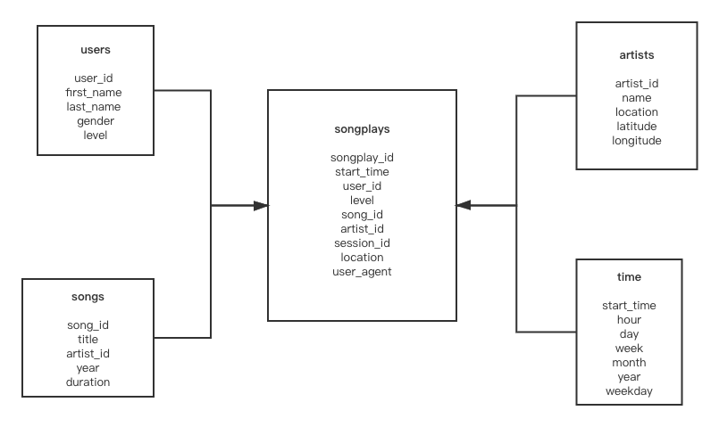

# Data Modeling with Postgres

## Table of contents
* [Introduction](#introduction)
* [Setup](#setup)

## Introduction 

A startup called Spartify would like to analyze the data collected from the songs and user acticity. They don't have an easy way to query the data, which resides in a directory of JSON logs on user activity on the app, as well as a directory with JSON metadata on the songs in their app.

The task for a data engineer is to create a Postgres database with tables designed to optimize queries on song play analysis. In the project, the data schema and ETL pipeline are to created, after that, test by running querying comparing to the expected results.

## Setup

### Dataset
There are two datasets used in the project. The first is the song dataset that is a subset of real data from [Million Song Dataset](https://labrosa.ee.columbia.edu/millionsong/). The files are partitioned by the first three letters of each song's track ID. 

The second dataset consists of log files in JSON format denerated by the [event simulator](https://github.com/Interana/eventsim) based on the songs in the dataset above. These simulate activity logs from a music streaming app based on specified configurations. Data in log files are partitioned by year and month.

### How to run 
* Set up local PostgreSQL instance, more detailed instructions in [PostgreSQL](https://www.postgresql.org/docs/9.1/runtime.html).
* Set up Python environment in version 3.7 or newer, run create_tables.py to set up databases, including reseting and creating tables. Do not forget to run this file before each time you run the ETL scripts.
* Run etl.py to conduct the ETL process. 
* Launch test.ipynb in Jupter Notebook to validate the ETL process.

### Database design
A star schema is used to design the sparkify database. The schema is composed of one fact table: songplays and four dimension tables: artist, songs, time and users. In the star schema shown below, each primary key in dimensional tables are referenced using foreign keys in the fact table. The songplay_id should be unique.

It is intuitive and easy to analyze data using sql under the star schema. Using JOIN, data from dimension tables could be retrieved efficiently.

